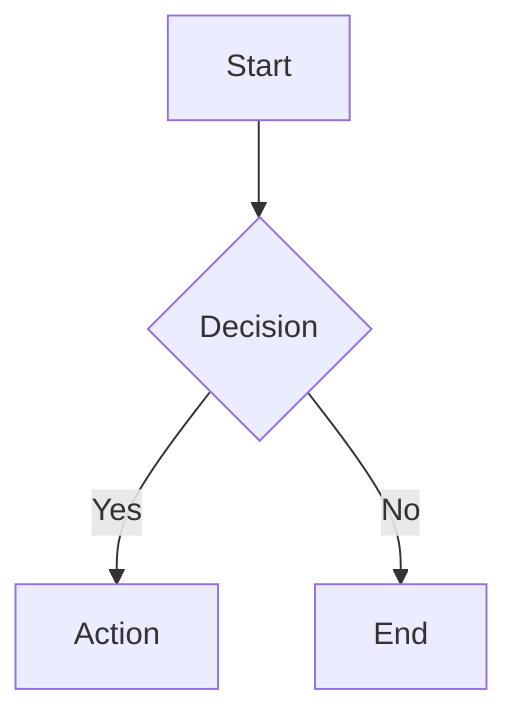

# Atlassian API Skill

Execute Confluence and Jira operations via direct REST API calls with automatic OAuth token refresh.

## When to Use This Skill

- Creating, updating, or reading Confluence pages
- Converting Markdown to Confluence storage format (with Mermaid diagram support)
- Uploading attachments to Confluence pages
- Searching Confluence content and navigating page hierarchies
- Creating, updating, or transitioning Jira issues
- **Adding or editing comments on Jira issues** (edit-in-place avoids duplicate notifications)
- **Adding internal comments to Jira Service Desk tickets** (shows as "Internal note" with lock icon)
- **@ mentioning users in Jira comments** (automatically resolves display names to account IDs)
- **Adding comments with custom visibility** (role-based or group-based restrictions)
- **Posting formatted comments with tables** (use `--markdown` flag for rich formatting)
- Searching Jira with JQL queries
- When the Atlassian MCP is unreliable or hanging
- When response efficiency is critical (this skill uses ~50 tokens vs ~2000 for MCP)

## OAuth Scopes

This skill uses **v2 granular OAuth scopes**. Your Atlassian app must have these scopes configured:

**Confluence (Required):**
- `read:content:confluence`, `write:content:confluence`
- `read:content-details:confluence`, `read:page:confluence`, `write:page:confluence`
- `read:space:confluence`

**Jira (Optional):**
- `read:jira-work`, `write:jira-work`, `read:jira-user`

**Required for refresh tokens:**
- `offline_access` - MUST be included

See [README.md](README.md) for complete OAuth setup instructions.

## Quick Start

```bash
# Set up config first (see README.md for OAuth setup)
cd ~/.claude/skills/atlassian-api

# Confluence operations
python3 scripts/atlassian_api.py --confluence search --query "PRI Container" --limit 10
python3 scripts/atlassian_api.py --confluence get-page --page-id 3174662145 --format markdown
python3 scripts/atlassian_api.py --confluence list-spaces

# Jira operations
python3 scripts/atlassian_api.py --jira search --jql "project = TWXDEV AND status = Open"
python3 scripts/atlassian_api.py --jira get-issue --issue-key TWXDEV-123

# Jira Service Desk - Internal comments with mentions (NEW!)
python3 scripts/atlassian_api.py --jira add-comment --issue-key IT-20374 \
  --body "Bug fix deployed to SB2" --internal --mention "Daniel Yubeta"

python3 scripts/atlassian_api.py --jira transition --issue-key TWXDEV-123 --to "Done"
```

## Confluence Operations

### Search Pages
```bash
# Search by title (partial match supported)
python3 scripts/atlassian_api.py --confluence search --query "Container" --limit 10

# Search within a specific space
python3 scripts/atlassian_api.py --confluence search --query "Container" --space TWXGBDL --limit 10
```

### Get Page Content
```bash
python3 scripts/atlassian_api.py --confluence get-page --page-id 3174662145 --format markdown
python3 scripts/atlassian_api.py --confluence get-page --page-id 3174662145 --format json
python3 scripts/atlassian_api.py --confluence get-page --page-id 3174662145 --format storage  # Raw XHTML
```

### Create Page
```bash
# From HTML file
python3 scripts/atlassian_api.py --confluence create-page --space TWXGBDL --title "New Page" --body-file content.html

# From Markdown file (auto-converted with TOC sidebar)
python3 scripts/atlassian_api.py --confluence create-page --space TWXGBDL --title "New Page" --body-file content.md --input-format md
```

### Update Page
```bash
# Standard update (HTML)
python3 scripts/atlassian_api.py --confluence update-page --page-id 3174662145 --body-file updated.html --message "Update note"

# Update from Markdown (auto-converted)
python3 scripts/atlassian_api.py --confluence update-page --page-id 3174662145 --body-file document.md --input-format md --message "Updated from markdown"

# Dry-run (preview without saving)
python3 scripts/atlassian_api.py --confluence update-page --page-id 3174662145 --body-file updated.md --input-format md --dry-run
```

### Move Page
```bash
# Move page to a new parent
python3 scripts/atlassian_api.py --confluence move-page --page-id 3174662145 --new-parent 1234567890

# Move page to space root (no parent)
python3 scripts/atlassian_api.py --confluence move-page --page-id 3174662145 --new-parent root
```

### Archive Page
```bash
# Archive a page (safer than delete - reversible via Confluence UI)
python3 scripts/atlassian_api.py --confluence archive-page --page-id 3174662145
```

### Delete Page
```bash
# Permanently delete a page (WARNING: irreversible!)
python3 scripts/atlassian_api.py --confluence delete-page --page-id 3174662145
```

### List Spaces
```bash
python3 scripts/atlassian_api.py --confluence list-spaces --limit 20
```

### List Pages in Space
```bash
python3 scripts/atlassian_api.py --confluence list-pages --space TWXGBDL --limit 20
```

### Get Child Pages
```bash
python3 scripts/atlassian_api.py --confluence get-children --page-id 3174662145 --limit 20
```

### Upload Attachment
```bash
python3 scripts/atlassian_api.py --confluence upload-attachment --page-id 3174662145 --file /path/to/image.png --comment "Screenshot"
```

### List Attachments
```bash
python3 scripts/atlassian_api.py --confluence list-attachments --page-id 3174662145
```

## Markdown to Confluence Converter

Convert Markdown files to Confluence storage format with full support for Mermaid diagrams.

### Basic Usage
```bash
# Convert markdown file to Confluence format
python3 scripts/md_to_confluence.py input.md output.html

# Then upload to Confluence
python3 scripts/atlassian_api.py --confluence update-page --page-id 123456 --body-file output.html
```

### Supported Markdown Features
- Headings (H1-H6) with automatic anchor generation
- Bold, italic, inline code
- Links and images
- Ordered and unordered lists
- Tables
- Code blocks with syntax highlighting
- Mermaid diagrams (rendered via weweave plugin)
- Horizontal rules
- Confluence Table of Contents macro (auto-generated in sidebar)

### Mermaid Diagram Support

The converter automatically converts Mermaid code blocks to the weweave "Mermaid Charts & Diagrams for Confluence" macro format.

**Example Markdown:**
````markdown

````

**Features enabled by default:**
- Theme: `neutral` (best for light/dark mode)
- Pan & zoom: enabled
- Fullscreen: enabled
- Alignment: center

### Mermaid Best Practices

**IMPORTANT: Follow these rules to avoid rendering errors:**

| Issue | Wrong | Correct |
|-------|-------|---------|
| Line breaks | `<br/>` | `<br>` |
| Nested brackets | `[Task: [value]]` | `[Task: value]` |
| Special chars in nodes | `Node[Text with "quotes"]` | `Node[Text with quotes]` |

**Common Errors:**

1. **"Parse error... Expecting 'SQE'"** - Usually caused by nested `[]` brackets in node definitions
   ```mermaid
   # WRONG - nested brackets break parser
   A[Task: [New value]]

   # CORRECT - remove inner brackets
   A[Task: New value]
   ```

2. **Diagram not rendering** - Check for `<br/>` tags (should be `<br>`)

3. **Broken in dark mode** - Use `neutral` theme instead of `default`

### Two-Column Layout with TOC

The converter automatically creates a two-column layout:
- **Left column**: Main content
- **Right sidebar**: Table of Contents (sticky navigation)

This matches the Confluence best practice for long documents.

## Jira Operations

### Search Issues (JQL)
```bash
python3 scripts/atlassian_api.py --jira search --jql "project = TWXDEV AND status = Open" --limit 20
python3 scripts/atlassian_api.py --jira search --jql "assignee = currentUser() ORDER BY updated DESC"
```

**Note:** Jira v3 API requires bounded queries. Always include a filter (project, assignee, etc.) - unbounded queries like `ORDER BY updated` alone will fail.

### Get Issue Details
```bash
python3 scripts/atlassian_api.py --jira get-issue --issue-key TWXDEV-123
python3 scripts/atlassian_api.py --jira get-issue --issue-key TWXDEV-123 --format json
```

### Create Issue
```bash
python3 scripts/atlassian_api.py --jira create-issue --project TWXDEV --type Task --summary "New task" --description "Details"
```

### Update Issue
```bash
python3 scripts/atlassian_api.py --jira update-issue --issue-key TWXDEV-123 --fields '{"summary": "Updated title"}'
```

### Add Comment
```bash
# Regular public comment
python3 scripts/atlassian_api.py --jira add-comment --issue-key TWXDEV-123 --body "This is a comment"

# Internal comment (restricted to Administrators role)
python3 scripts/atlassian_api.py --jira add-comment --issue-key TWXDEV-123 --body "Internal note" --internal

# Custom group visibility (e.g., "Internal note" group)
python3 scripts/atlassian_api.py --jira add-comment --issue-key TWXDEV-123 --body "Team only" --visibility "group:Internal note"

# Custom role visibility (e.g., "Developers" role)
python3 scripts/atlassian_api.py --jira add-comment --issue-key TWXDEV-123 --body "Dev team" --visibility "role:Developers"

# Comment with @ mentions (by display name or account ID)
python3 scripts/atlassian_api.py --jira add-comment --issue-key TWXDEV-123 --body "Please review" --mention "Daniel Yubeta"

# Multiple mentions (comma-separated)
python3 scripts/atlassian_api.py --jira add-comment --issue-key TWXDEV-123 --body "Team update" --mention "Daniel Yubeta,John Doe"

# Combine visibility + mentions
python3 scripts/atlassian_api.py --jira add-comment --issue-key TWXDEV-123 --body "Confidential" --visibility "group:Internal note" --mention "Daniel Yubeta"
```

**Visibility Options:**
- `--internal`: Restricts to "Administrators" role (shortcut)
- `--visibility "group:Name"`: Restricts to specific group
- `--visibility "role:Name"`: Restricts to specific role
- Omit prefix for group: `--visibility "Internal note"` defaults to group

**Note:** @ mentions require the user to be assignee or reporter of the issue. If the display name cannot be resolved to an account ID, the script will fall back to plain text.

### Edit Comment
```bash
# Edit an existing comment (plain text)
python3 scripts/atlassian_api.py --jira edit-comment --issue-key TWXDEV-123 --comment-id 12345 --body "Updated comment text"

# Edit with markdown formatting (tables, bold, lists, etc.)
python3 scripts/atlassian_api.py --jira edit-comment --issue-key TWXDEV-123 --comment-id 12345 --body "## Updated

| Col1 | Col2 |
|---|---|
| A | B |

**Bold** text here" --markdown

# Edit with visibility change
python3 scripts/atlassian_api.py --jira edit-comment --issue-key TWXDEV-123 --comment-id 12345 --body "Internal only" --internal
```

**Why use edit-comment instead of delete + add:**
- Edit-in-place sends only **one notification** to watchers
- Delete + add sends **two notifications** (one for delete, one for add)
- Edit preserves the comment's position in the thread

### Transition Issue
```bash
# First, list available transitions
python3 scripts/atlassian_api.py --jira transitions --issue-key TWXDEV-123

# Then transition
python3 scripts/atlassian_api.py --jira transition --issue-key TWXDEV-123 --to "Done"
```

### List Projects
```bash
python3 scripts/atlassian_api.py --jira list-projects --limit 20
```

### List Issue Types
```bash
# All issue types
python3 scripts/atlassian_api.py --jira list-issue-types

# Issue types for specific project
python3 scripts/atlassian_api.py --jira list-issue-types --project TWXDEV
```

## Multi-Site Support

```bash
# Default site (from config)
python3 scripts/atlassian_api.py --confluence search --query "Container"

# Specific site
python3 scripts/atlassian_api.py --site twx --confluence search --query "Container"
python3 scripts/atlassian_api.py --site dm --jira search --jql "project = DM"

# List available sites
python3 scripts/atlassian_api.py --list-sites
```

## Output Formats

| Format | Use Case | Token Usage |
|--------|----------|-------------|
| `table` | Human-readable listing (default) | ~50 tokens |
| `json` | Programmatic processing | ~100 tokens |
| `csv` | Data export | ~30 tokens |
| `markdown` | Page content with formatting | Varies |
| `storage` | Raw Confluence XHTML | Varies |

## Common Options

```
--site, -s       Site alias (twx, dm, etc.)
--format, -f     Output format: table, json, csv, markdown, storage
--limit, -l      Max results (default: 20)
--timeout, -t    Request timeout in seconds (default: 30)
--verbose, -v    Show debug info
--refresh-auth   Force refresh authentication token (useful if getting 401 errors)
--dry-run        Preview changes without saving (update-page only)
--input-format   Input format for body content: html (default) or md (auto-converted)
```

## Response Efficiency

This skill produces compact output compared to the Atlassian MCP:

**MCP Response (~2000 tokens):**
```json
{"parentType":"page","parentId":"1821736961","lastOwnerId":null,...full nested JSON...}
```

**This Skill (~50 tokens):**
```
[twistedx.atlassian.net] Confluence - 3 page(s)
ID          | Title                              | Space  | Updated
3174563841  | PRI Departure Ports - Admin...     | TWXGBDL| 2025-12-16
```

## Troubleshooting

### Authentication Errors
```bash
# Test authentication
python3 scripts/auth.py

# Force token refresh (useful if getting persistent 401 errors)
python3 scripts/atlassian_api.py --refresh-auth --confluence list-spaces

# If token expired, the skill auto-refreshes
# If 401 error occurs, the skill automatically clears cache and retries once
# If refresh token invalid, re-run OAuth flow (see README.md)
```

### Common Issues

| Error | Cause | Solution |
|-------|-------|----------|
| "Config file not found" | No config | Copy template to `config/atlassian_config.json` |
| "Token refresh failed" | Invalid refresh token | Re-run OAuth authorization flow |
| "HTTP 403" | Missing permissions | Check OAuth app scopes |
| "Space not found" | Wrong space key | Use `--confluence list-spaces` to verify |
| "Unbounded JQL queries not allowed" | Missing filter in JQL | Add project, assignee, or other filter |
| "Parse error" in Mermaid | Invalid syntax | Check for nested `[]` or `<br/>` tags |

## Files

- `scripts/atlassian_api.py` - Main CLI executor
- `scripts/md_to_confluence.py` - Markdown to Confluence converter
- `scripts/auth.py` - OAuth 2.0 authentication
- `scripts/formatters.py` - Response formatting
- `config/atlassian_config.json` - Credentials (create from template)
- `references/confluence_api.md` - Confluence API patterns
- `references/jira_api.md` - Jira JQL reference

## Related Documentation

- [README.md](README.md) - Installation and OAuth setup
- [references/confluence_api.md](references/confluence_api.md) - Confluence patterns
- [references/jira_api.md](references/jira_api.md) - JQL syntax reference
