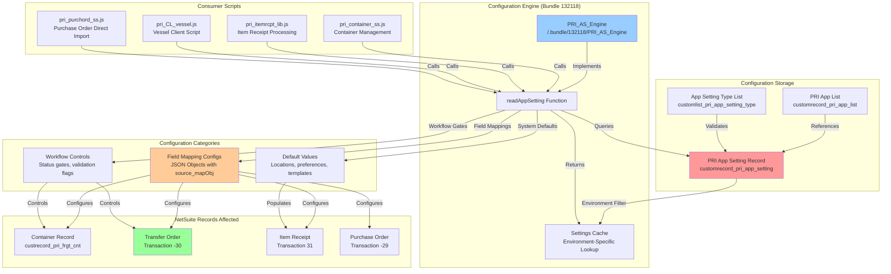
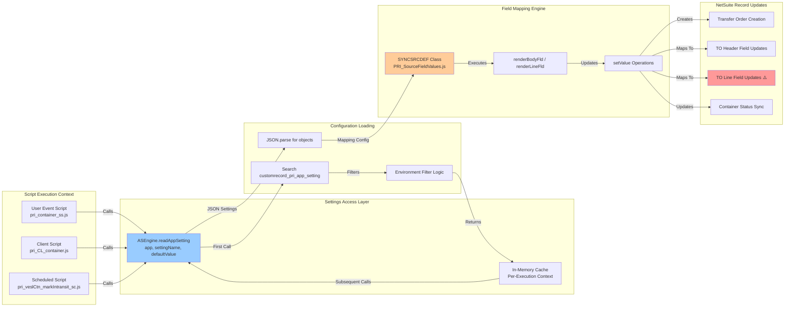

# PRI Application Settings Architecture

**Analysis Date:** 2025-11-12  
**System:** PRI App Settings (Bundle 132118) + Container Tracking (Bundle 125246)  
**Purpose:** Configuration architecture mapping and Transfer Order line date sync analysis

---

## Executive Summary

The PRI Application Settings system (`customrecord_pri_app_setting`) provides **dynamic, environment-specific configuration** for Prolecto bundles without requiring script parameter changes or redeployment. Settings are loaded on-demand via the **PRI_AS_Engine** module (Bundle 132118) and consumed across multiple bundles to control field mappings, workflow behaviors, and validation rules.

### Critical Finding: Transfer Order Line Date Sync Configuration

**Issue:** Container "Date Destination Estimated" (`custrecord_pri_frgt_cnt_date_dest_est`) does not sync to Transfer Order line dates.

**Root Cause:** The application setting `"TrnfrOrd Line Field Mapping From Container"` only maps:
- `expectedreceiptdate` ← `custrecord_pri_frgt_cnt_date_dest_est` 
- `expectedshipdate` ← `custrecord_pri_frgt_cnt_date_sail`

This configuration maps container dates to **Transfer Order HEADER fields**, not to **line-level date fields** like `shipdate` or `expectedreceiptdate` on individual item lines.

---

## Configuration Architecture Diagram



---

## Custom Record Structure

### customrecord_pri_app_setting

**Purpose:** Stores application configuration with environment-specific overrides

| Field ID | Label | Type | Description |
|----------|-------|------|-------------|
| `name` | Name | TEXT | **Setting identifier** (e.g., "TrnfrOrd Line Field Mapping From Container") |
| `custrecord_pri_as_app` | Application | SELECT | References `customrecord_pri_app_list` (e.g., "Prolecto Freight Container & Landed Cost") |
| `custrecord_pri_as_type` | Type | SELECT | Data type from `customlist_pri_app_setting_type` (Text, Boolean, Integer, Date, Number, JSON Object) |
| `custrecord_pri_as_value` | Value | CLOBTEXT | **Configuration payload** (supports JSON objects, text, numbers) |
| `custrecord_pri_as_environment` | Environment | TEXT | **Environment filter** (PRODUCTION, SANDBOX, ACCOUNT_ID) |
| `custrecord_pri_as_desc` | Description | TEXTAREA | Usage documentation |

**Key Features:**
1. **Environment-Specific Lookup**: Settings can be scoped to PRODUCTION, SANDBOX, or specific account IDs
2. **Hierarchical Resolution**: Searches from most specific (ACCOUNT_ID) → ENVIRONMENT → blank (all environments)
3. **Flat Structure**: No parent-child relationships; settings are independent records
4. **Bundle-Global**: Settings apply across all environments where bundle is deployed

---

## Setting Taxonomy & Configuration Patterns

### 1. Field Mapping Configurations (JSON Object Type)

**Purpose:** Define source-to-target field transformations using PRI_SourceFieldValues.js engine

#### Pattern: Body-Level Field Mapping
```json
{
  "sync_arr": ["field1", "field2"],          // Direct field-to-field copy
  "source_mapObj": {                         // Sourcing from related records
    "targetField": "relatedRecord.sourceField"
  },
  "default_mapObj": {                        // Default values
    "targetField": "staticValue"
  }
}
```

**Example Settings:**

**`TO Item Receipt Field Mapping From Container`** (ID: 452)
```json
{
  "source_mapObj": {
    "custbody_pri_frgt_loc_ult": "custrecord_pri_frgt_cnt_location_dest"
  }
}
```
Maps Container destination location → Item Receipt ultimate location (body field)

**`TrnfrOrd Line Field Mapping From Container`** (ID: 250) ⚠️ **CRITICAL**
```json
{
  "source_mapObj": {
    "expectedreceiptdate": "custrecord_pri_frgt_cnt_date_dest_est",
    "expectedshipdate": "custrecord_pri_frgt_cnt_date_sail"
  }
}
```
**Current Behavior:** Maps container dates to **Transfer Order HEADER fields only**  
**Missing Configuration:** No mapping for line-level `shipdate` or `expectedreceiptdate` fields

#### Pattern: Line-Level Field Mapping
```json
{
  "sync_arr": ["custcol_field1", "custcol_field2"],
  "source_mapObj": {
    "custcol_target": "body.sourceField"     // Source from body to line
  }
}
```

**Example:**

**`TRNFRORD LINE FIELD MAPPING ITEMRCPT`** (ID: 257)
```json
{
  "sync_arr": ["custcol_pri_bpa_so_line"]
}
```
Syncs sales order line reference from Item Receipt to Transfer Order lines

---

### 2. Workflow Control Settings (Text/JSON Type)

**Purpose:** Control status transitions, validation gates, and feature toggles

| Setting Name | Type | Value | Purpose |
|--------------|------|-------|---------|
| **Target Status of Transfer Order Received** | Text (JSON) | `{"RECEIVED": 7}` | Defines status ID for "Received" state |
| **Target Status of Mark In-transit** | Text | `2` | Container status ID for "In-Transit" |
| **Vessel Allowed Status Manually** | JSON | `[1,2,3]` | Status IDs users can manually set on vessels |
| **Date Destination Estimate Calculated Validation** | Text | `T` | Enable validation of calculated destination dates |
| **Lock PO Item Receipt when not at Origin Port** | Text | `F` | Prevent IR edits when container in-transit |

**Usage Example:**
```javascript
// In pri_CL_container.js saveRecord()
var strTrgtStatus = ASEngine.readAppSetting(
    'Prolecto Freight Container & Landed Cost', 
    'Target Status of Transfer Order Received'
);
var intTrgtStatus = (strTrgtStatus && JSON.parse(strTrgtStatus)['RECEIVED']) 
    ? JSON.parse(strTrgtStatus)['RECEIVED'] 
    : '';
```

---

### 3. Default Value Settings (Text Type)

**Purpose:** System-wide defaults for fields, templates, and preferences

| Setting Name | Example Value | Purpose |
|--------------|---------------|---------|
| **Default Landed Cost Rate Preference** | `2` | Default rate preference for landed cost allocation |
| **Default Direct Import Sales Order Line Commit Field** | `{"commit": "custcol_commit_field"}` | Field mapping for SO line commits |
| **Direct Import PO default Location Mapping** | `{"location": "intPOLoc", "custbody_pri_frgt_loc_ult": "intPOLocUlt"}` | Location defaults for direct import POs |

**Usage Example:**
```javascript
// In pri_itemrcpt_lib.js getItemLC_ratePrf()
if (!intLcRatePrf)
    intLcRatePrf = ASEngine.readAppSetting(
        'Prolecto Freight Container & Landed Cost', 
        'Default Landed Cost Rate Preference'
    );
```

---

## Settings Consumption Architecture

### Script → Settings → Records Flow



### Key Consumer Scripts

#### 1. Container Management (`pri_container_ss.js`)

**afterSubmit Context:**
```javascript
// Called when container is edited
TRANLIB.pri_ctn_fc_healTrnfrOrd(scriptContext);
```

**Loads Settings:**
- `TrnfrOrd Line Field Mapping From Container` (ID: 250)
- `TRNFRORD LINE FIELD MAPPING ITEMRCPT` (ID: 257)

**Processing Flow:**
1. Load container record
2. Load linked transfer order
3. Read field mapping settings from App Settings
4. Apply mappings using SYNCSRCDEF engine
5. Update transfer order header and lines
6. Save transfer order

**Code Location:**
```javascript
// In pri_itemrcpt_lib.js - FRGTCTNTRST constructor
var strTrnfrOrd_lineMappingFromCtn = ASEngine.readAppSetting(
    'Prolecto Freight Container & Landed Cost', 
    'TrnfrOrd Line Field Mapping From Container'
);
var objTrnfrOrd_lineMappingFromCtn = strTrnfrOrd_lineMappingFromCtn 
    ? JSON.parse(strTrnfrOrd_lineMappingFromCtn) 
    : '';
this.objTrnfrOrd_lineMappingFromCtn = objTrnfrOrd_lineMappingFromCtn;
```

#### 2. Item Receipt Processing (`pri_itemrcpt_lib.js`)

**Loads Settings:**
- `TO Item Receipt Field Mapping From Container` (ID: 452)
- `PO Item Receipt Field Mapping From Container` (ID: 451)
- `TRNFRORD BODY FIELD MAPPING ITEMRCPT` (ID: 258)
- `TRNFRORD LINE FIELD MAPPING ITEMRCPT` (ID: 257)

**Processing Flow:**
```javascript
// Determine transaction type
if (strTranFromTranType == record.Type.TRANSFER_ORDER) {
    strItemRcpt_bodyMapping = ASEngine.readAppSetting(
        'Prolecto Freight Container & Landed Cost', 
        'TO Item Receipt Field Mapping From Container'
    );
} else if (strTranFromTranType == record.Type.PURCHASE_ORDER) {
    strItemRcpt_bodyMapping = ASEngine.readAppSetting(
        'Prolecto Freight Container & Landed Cost', 
        'PO Item Receipt Field Mapping From Container'
    );
}

// Apply mappings
var objItemRcpt_bodyMapping = strItemRcpt_bodyMapping 
    ? JSON.parse(strItemRcpt_bodyMapping) 
    : '';

if (objItemRcpt_bodyMapping)
    objItemRcptRec = new SETFLDVAL.SYNCSRCDEF(objItemRcpt_bodyMapping)
        .renderBodyFld(objContainerRec, objItemRcptRec);
```

#### 3. Vessel Client Script (`pri_CL_vessel.js`)

**Loads Settings:**
- `Vessel Allowed Status Manually` (ID: 567)
- `Target Status of Transfer Order Received` (ID: 255)

**Validation Flow:**
```javascript
// In fieldChanged event for status field
var intAllowedStatus = ASEngine.readAppSetting(
    'Prolecto Freight Container & Landed Cost', 
    'Vessel Allowed Status Manually'
);
if (intAllowedStatus.indexOf(intCtnStatus) == -1 && intCtnStatus) {
    message.create({
        title: 'Notification',
        message: 'Vessel Status Validation. Not allow move to: ' + 
                 currentRecord.getText('custrecord_pri_frgt_cnt_vsl_log_status'),
        type: message.Type.WARNING
    }).show();
    currentRecord.setValue('custrecord_pri_frgt_cnt_vsl_log_status', '');
}
```

---

## Field Mapping Engine: PRI_SourceFieldValues.js

### SYNCSRCDEF Class Architecture

**Purpose:** Declarative field mapping engine that transforms source records to target records using JSON configuration

#### Core Methods

**1. renderBodyFld(objTran_src, objTran_trgt)**
- Processes body-level field mappings
- Supports sync_arr, source_mapObj, default_mapObj
- Returns updated target transaction

**2. renderLineFld(objTran_src, objTran_trgt)**
- Processes line-level field mappings
- Iterates through all lines in target transaction
- Applies mappings to each line

**3. syncRecData(objTran_src, objTran_trgt)**
- Direct field-to-field copy from sync_arr
- No transformation logic

**4. srcRecData(objTran_src, objTran_trgt)**
- Handles related record sourcing
- Supports dot notation: `"relatedRec.fieldId.targetField"`
- Caches loaded records for performance

**5. defRecData(objTran_src, objTran_trgt)**
- Sets default values from default_mapObj
- Supports `eval()` expressions for dynamic defaults

#### Mapping Pattern Examples

**Simple Sync (Direct Copy):**
```json
{
  "sync_arr": ["fieldA", "fieldB", "fieldC"]
}
```
Copies fieldA, fieldB, fieldC from source → target

**Source Mapping (Related Record Lookup):**
```json
{
  "source_mapObj": {
    "targetField": "transaction.relatedId.sourceField"
  }
}
```
Loads related transaction, extracts sourceField → targetField

**Default Values (Static Assignment):**
```json
{
  "default_mapObj": {
    "targetField": "staticValue",
    "dateField": "eval(new Date())"
  }
}
```
Sets targetField = "staticValue", dateField = current date

**Combined Pattern:**
```json
{
  "sync_arr": ["field1", "field2"],
  "source_mapObj": {
    "field3": "entity.vendor.field3Source"
  },
  "default_mapObj": {
    "field4": "defaultValue"
  }
}
```
Applies all three transformation types in sequence

---

## Settings vs Script Parameters

### Why Use App Settings Instead of Script Parameters?

| Feature | App Settings | Script Parameters |
|---------|--------------|-------------------|
| **Deployment** | No script redeployment needed | Requires script redeployment |
| **Environment Control** | Built-in environment filtering | Separate parameters per environment |
| **JSON Support** | Native JSON parsing in CLOBTEXT | Limited to text/number types |
| **Centralized Management** | Single record type, searchable | Scattered across script deployments |
| **Audit Trail** | System notes track changes | No built-in change tracking |
| **Dynamic Loading** | On-demand cache with environment lookup | Static at script deployment |

**Trade-offs:**
- **Performance**: Script parameters are slightly faster (no search required)
- **Flexibility**: App Settings allow runtime changes without deployment
- **Complexity**: App Settings require understanding of PRI_AS_Engine architecture

---

## Gap Analysis: Transfer Order Line Date Sync Issue

### Current Configuration (Setting ID: 250)

**Setting Name:** `TrnfrOrd Line Field Mapping From Container`

**Current JSON Value:**
```json
{
  "source_mapObj": {
    "expectedreceiptdate": "custrecord_pri_frgt_cnt_date_dest_est",
    "expectedshipdate": "custrecord_pri_frgt_cnt_date_sail"
  }
}
```

### Problem Analysis

**1. Field Type Mismatch**
- **Target Fields:** `expectedreceiptdate`, `expectedshipdate`
- **Field Location:** Transfer Order **BODY fields** (header-level)
- **User Expectation:** Line-level date fields (`custcol_...` or sublist date columns)

**2. Mapping Engine Limitation**
The setting is consumed by:
```javascript
// pri_itemrcpt_lib.js - FRGTCTNTRST class
this.objTrnfrOrd_lineMappingFromCtn = objTrnfrOrd_lineMappingFromCtn;

// Applied during transfer order healing/update
if (this.objTrnfrOrd_lineMappingFromCtn) {
    objTrnfrOrdRec = new SETFLDVAL.SYNCSRCDEF(
        this.objTrnfrOrd_lineMappingFromCtn, 
        {sublistId: 'item'}
    ).renderLineFld(this.objFrgtCtnRec, objTrnfrOrdRec);
}
```

**Key Issue:** The `renderLineFld` method expects **line-level fields** in the configuration, but the current setting provides **body-level fields**.

**3. NetSuite Transfer Order Line Date Fields**

Transfer Order line item sublist fields:
- `shipdate` - Ship date on line item
- `expectedreceiptdate` - Expected receipt date on line item (if it exists as line field)
- Standard line fields are prefixed with `custcol_` for custom fields

**Body-level fields cannot be mapped to line-level fields using this engine pattern.**

### Recommended Solution

**Option 1: Update App Setting Configuration**

Modify Setting ID 250 to map to actual line-level date fields:

```json
{
  "source_mapObj": {
    "shipdate": "custrecord_pri_frgt_cnt_date_sail",
    "custcol_expected_receipt": "custrecord_pri_frgt_cnt_date_dest_est"
  }
}
```

**Prerequisites:**
1. Verify Transfer Order line item sublist has date fields available
2. Confirm field IDs: `shipdate`, `custcol_expected_receipt`, or equivalent
3. Ensure fields are NOT display-only (must be settable via API)

**Option 2: Add Custom Script Logic**

If NetSuite Transfer Order lines don't support settable date fields via standard API, implement custom logic in `pri_itemrcpt_lib.js`:

```javascript
// In FRGTCTNTRST.healTrnfrOrd or similar method
var dateDestEst = this.objFrgtCtnRec.getValue('custrecord_pri_frgt_cnt_date_dest_est');
var lineCnt = objTrnfrOrdRec.getLineCount({sublistId: 'item'});

for (var i = 0; i < lineCnt; i++) {
    objTrnfrOrdRec.setSublistValue({
        sublistId: 'item',
        fieldId: 'shipdate',        // or appropriate line field
        line: i,
        value: dateDestEst
    });
}
```

**Option 3: Verify Field Availability**

Transfer Order line items may not have editable date fields. Investigate:
1. NetSuite standard Transfer Order line item schema
2. Available custom line fields on Transfer Order
3. Whether dates should be set on related Item Fulfillment instead

---

## Environment-Specific Configuration

### Environment Filter Logic

**Search Priority (from PRI_AS_Engine readAppSetting):**
1. **Account ID Match**: `custrecord_pri_as_environment` = "4138030"
2. **Environment Match**: `custrecord_pri_as_environment` = "PRODUCTION" or "SANDBOX"
3. **Global Default**: `custrecord_pri_as_environment` = "" (blank)

**Example Use Case:**
```
Setting: "Default Landed Cost Rate Preference"

Record 1:
  - Name: "Default Landed Cost Rate Preference"
  - App: Prolecto Freight Container & Landed Cost
  - Environment: ""
  - Value: "2"
  - Description: Global default

Record 2:
  - Name: "Default Landed Cost Rate Preference"
  - App: Prolecto Freight Container & Landed Cost
  - Environment: "SANDBOX"
  - Value: "1"
  - Description: Test environment uses rate preference 1

Record 3:
  - Name: "Default Landed Cost Rate Preference"
  - App: Prolecto Freight Container & Landed Cost
  - Environment: "4138030"
  - Value: "3"
  - Description: Production account override
```

**Resolution:**
- **Production Account 4138030**: Returns "3" (most specific)
- **Sandbox Account 4138030_SB1**: Returns "1" (SANDBOX match)
- **Other Production Accounts**: Returns "2" (global default)

---

## Settings Cache Architecture

### Cache Invalidation

**Per-Execution Context:**
- Cache is stored in script memory during execution
- Cleared when script completes
- No cross-execution persistence

**Performance Optimization:**
```javascript
// First call: Performs search
var value1 = ASEngine.readAppSetting('App', 'Setting1');  // SEARCH

// Second call: Returns cached
var value2 = ASEngine.readAppSetting('App', 'Setting1');  // CACHE HIT

// Different setting: Performs search
var value3 = ASEngine.readAppSetting('App', 'Setting2');  // SEARCH
```

**Cache Key:** `applicationId + settingName + environment`

**Implications:**
- High-volume scripts benefit from caching (e.g., scheduled scripts processing 1000+ records)
- Manual setting changes require script re-execution to take effect
- No stale data risk across different executions

---

## Deployment & Migration Considerations

### Bundle Dependency

**Primary Bundle:** PRI_AS_Engine (Bundle 132118)
**Consumer Bundles:**
- Bundle 125246 - PRI Container Tracking
- Bundle 168443 - PRI Record State Manager

**Installation Order:**
1. Install Bundle 132118 (PRI_AS_Engine + PRI_QM_Engine)
2. Install consumer bundles (125246, 168443)
3. Create App Settings records
4. Populate setting values via CSV import or manual entry

### CSV Import Template

```csv
isinactive,custrecord_pri_as_app,custrecord_pri_as_type,name,custrecord_pri_as_value,custrecord_pri_as_environment,custrecord_pri_as_desc
No,[app_internal_id],1,TrnfrOrd Line Field Mapping From Container,"{""source_mapObj"":{""expectedreceiptdate"":""custrecord_pri_frgt_cnt_date_dest_est"",""expectedshipdate"":""custrecord_pri_frgt_cnt_date_sail""}}","","Maps container dates to transfer order line date fields"
```

**Reference File:** `/SuiteBundles/Bundle 125246/PRI Container Tracking/ProlectoFreightContainer_AppSettingDefault20220715.csv`

---

## Testing & Validation

### Validation Checklist for Transfer Order Line Date Fix

1. **Environment Setup**
   - [ ] Backup current `TrnfrOrd Line Field Mapping From Container` setting
   - [ ] Identify Transfer Order line date field IDs
   - [ ] Verify fields are settable via SuiteScript API

2. **Configuration Update**
   - [ ] Update App Setting JSON with line-level field mappings
   - [ ] Test in SANDBOX environment first
   - [ ] Verify environment filter is blank or appropriate

3. **Functional Testing**
   - [ ] Create new container with Date Destination Estimated
   - [ ] Create transfer order from container
   - [ ] Verify transfer order line dates populate correctly
   - [ ] Edit container date → verify transfer order lines update
   - [ ] Test with multiple line items

4. **Integration Testing**
   - [ ] Item receipt creation from transfer order
   - [ ] Transfer order fulfillment
   - [ ] Container status transitions (In-Transit → Received)
   - [ ] Production management quantity tracking

5. **Rollback Plan**
   - [ ] Document original setting value
   - [ ] Test rollback procedure in SANDBOX
   - [ ] Prepare communication for users if behavior changes

---

## Appendix A: Complete Settings Inventory for Container Tracking

| ID | Setting Name | Type | Purpose | Consumer Scripts |
|----|--------------|------|---------|------------------|
| 250 | TrnfrOrd Line Field Mapping From Container | JSON | **Transfer Order line field mappings** | pri_itemrcpt_lib.js, pri_container_ss.js |
| 251 | Default Landed Cost Rate Preference | Text | Default LC allocation preference | pri_itemrcpt_lib.js |
| 252 | Container Status to Update Parent Vessel | Text | Status ID for vessel update trigger | pri_container_ss.js |
| 253 | Change Adjusted Est. Time of Arrival Search | Text | Saved search ID for date changes | pri_container_ss.js |
| 254 | Mark In-transit Show Roles | JSON | Roles allowed to mark in-transit | pri_CL_container.js |
| 255 | Target Status of Transfer Order Received | Text/JSON | Status ID for "Received" state | pri_CL_container.js, pri_CL_vessel.js |
| 256 | Target Status of Mark In-transit | Text | Status ID for "In-Transit" state | pri_veslCtn_markIntransit_sc.js |
| 257 | TRNFRORD LINE FIELD MAPPING ITEMRCPT | JSON | TO line fields from IR | pri_itemrcpt_lib.js |
| 258 | TRNFRORD BODY FIELD MAPPING ITEMRCPT | JSON | TO body fields from IR | pri_itemrcpt_lib.js |
| 451 | PO Item Receipt Field Mapping From Container | JSON | IR body fields from container (PO mode) | pri_itemrcpt_lib.js |
| 452 | TO Item Receipt Field Mapping From Container | JSON | IR body fields from container (TO mode) | pri_itemrcpt_lib.js |
| 565 | Direct Import PO Field Mapping From SO | JSON | PO fields from sales order | pri_purchord_ss.js |
| 566 | Item Receipt Queued Message | Text | User message for queue processing | pri_itemrcpt_ss.js |
| 567 | Vessel Allowed Status Manually | JSON | Status IDs for manual vessel updates | pri_CL_vessel.js |
| 569 | Lock PO Item Receipt when not at Origin Port | Text | Enable/disable IR lock when in-transit | pri_itemrcpt_ss.js |
| 570 | Message for PO Item Receipt not at Origin Port | Text | Warning message for locked IR | pri_itemrcpt_ss.js |

---

## Appendix B: Field Mapping Engine Code References

**File:** `/SuiteBundles/Bundle 125246/PRI Container Tracking/PRI_SourceFieldValues.js`

**Key Classes:**
- `SYNCSRCDEF` - Main field mapping engine
- Methods: `renderBodyFld`, `renderLineFld`, `syncRecData`, `srcRecData`, `defRecData`

**File:** `/SuiteBundles/Bundle 125246/PRI Container Tracking/pri_itemrcpt_lib.js`

**Key Classes:**
- `FRGTCTNTRST` - Freight container transit orchestration
- Methods: `createTrnfrOrd`, `healTrnfrOrd`, `touchContainer`

**Usage Pattern:**
```javascript
// Load settings
var strMapping = ASEngine.readAppSetting(appName, settingName);
var objMapping = strMapping ? JSON.parse(strMapping) : '';

// Apply mappings
if (objMapping) {
    targetRecord = new SETFLDVAL.SYNCSRCDEF(objMapping, {sublistId: 'item'})
        .renderLineFld(sourceRecord, targetRecord);
}
```

---

## Document Change Log

| Date | Version | Author | Changes |
|------|---------|--------|---------|
| 2025-11-12 | 1.0 | System Architect | Initial analysis and architecture documentation |

---

## References

1. **Custom Records:**
   - `/Objects/customrecordtype/customrecord_pri_app_setting.xml`
   - `/Objects/customrecordtype/customrecord_pri_app_list.xml`

2. **Configuration Files:**
   - `/SuiteBundles/Bundle 125246/PRI Container Tracking/ProlectoFreightContainer_AppSettingDefault20220715.csv`

3. **Core Scripts:**
   - Bundle 132118: PRI_AS_Engine.js (not in codebase, referenced via `/.bundle/132118/PRI_AS_Engine`)
   - `/SuiteBundles/Bundle 125246/PRI Container Tracking/PRI_SourceFieldValues.js`
   - `/SuiteBundles/Bundle 125246/PRI Container Tracking/pri_itemrcpt_lib.js`
   - `/SuiteBundles/Bundle 125246/PRI Container Tracking/pri_container_ss.js`

4. **Related Documentation:**
   - `PRI_CONTAINER_TRACKING_MASTER_REFERENCE.md`
   - `PRI_CONTAINER_BACKEND_PROCESSING.md`
   - `PRI_CONTAINER_TRACKING_DATA_MODEL.md`

---

**END OF DOCUMENT**
