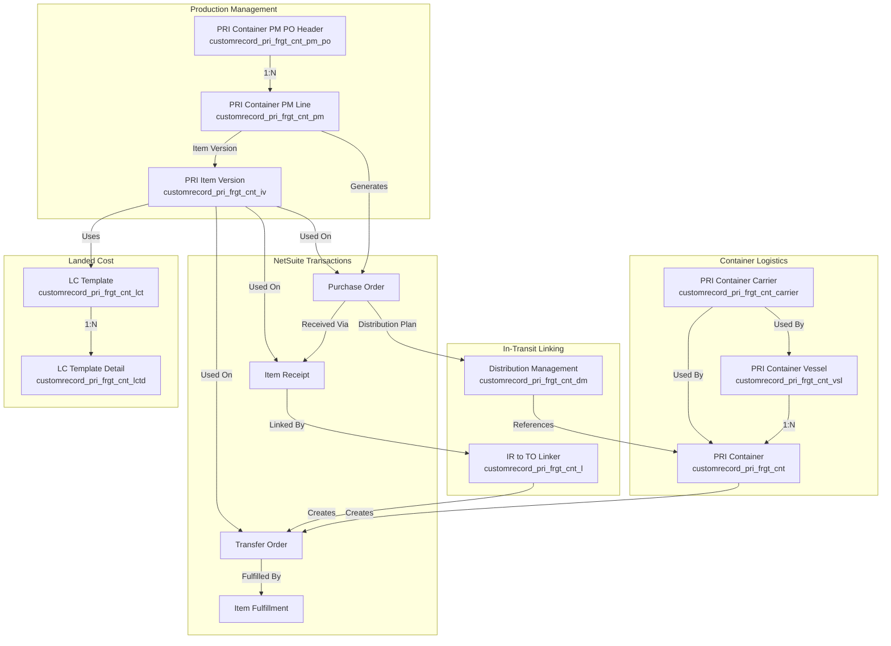

# PRI Container Tracking - Complete Data Model Documentation

**Investigation Date:** 2025-11-12
**Bundle:** Bundle 125246 - PRI Container Tracking
**Developer:** Prolecto Resources, Inc.

---

## Executive Summary

The PRI Container Tracking system is a sophisticated NetSuite module designed for **freight container logistics management**, **production planning**, **purchase order management**, and **in-transit inventory tracking**. The system manages the complete lifecycle from production planning through container transit to final warehouse distribution.

### Core Business Processes
1. **Production Planning** - Pre-PO item planning with price locking and item versioning
2. **Container Logistics** - Multi-modal freight tracking (vessel, port, warehouse)
3. **In-Transit Distribution** - Item receipt to transfer order linking for distribution
4. **Landed Cost Management** - Template-based cost allocation and item versioning

---

## Entity Relationship Diagram



---

## Custom Record Types

### 1. PRI Container Production Management PO Header
**Script ID:** `customrecord_pri_frgt_cnt_pm_po`
**Purpose:** Emulates a blanket purchase order for production planning purposes
**Type:** Header record for production line items

#### Fields
| Field ID | Label | Type | Description |
|----------|-------|------|-------------|
| `custrecord_pri_frgt_cnt_pm_po_date` | Date | DATE | Production PO date (defaults to NOW) |
| `custrecord_pri_frgt_cnt_pm_po_period` | Period | SELECT (Accounting Period) | Reference to accounting period |
| `custrecord_pri_frgt_cnt_pm_po_status` | Status | SELECT (Document Status) | Status filtered to Purchase Order types |
| `custrecord_pri_frgt_cnt_pm_po_entity` | Vendor | SELECT (Vendor) | Vendor reference (mandatory) |
| `custrecord_pri_frgt_cnt_pm_po_currency` | Currency | SELECT (Currency) | Transaction currency |
| `custrecord_pri_frgt_cnt_pm_po_department` | Department | SELECT (Department) | Department classification |
| `custrecord_pri_frgt_cnt_pm_po_class` | Class | SELECT (Class) | Class classification |

#### Business Rules
- Acts as parent/header for Production Management Lines
- Supports "PO Generator" tab when all child lines are locked
- Enables bulk PO creation from planning lines
- Tracks total quantities ordered vs. planned

---

### 2. PRI Container Production Management Line
**Script ID:** `customrecord_pri_frgt_cnt_pm`
**Purpose:** Line-level production planning with price locking and item versioning
**Type:** Child record (parent: Production Management PO)
**Order:** isordered=T (maintains line sequence)

#### Fields
| Field ID | Label | Type | Description |
|----------|-------|------|-------------|
| `custrecord_pri_frgt_cnt_pm_parent` | Parent | SELECT (PM PO Header) | **Parent relationship** (mandatory) |
| `custrecord_pri_frgt_cnt_pm_period` | Period | SELECT (Accounting Period) | Sourced from parent |
| `custrecord_pri_frgt_cnt_pm_vendor` | Vendor | SELECT (Vendor) | Sourced from parent |
| `custrecord_pri_frgt_cnt_pm_currency` | Currency | SELECT (Currency) | Sourced from parent |
| `custrecord_pri_frgt_cnt_pm_item` | Item | SELECT (Item) | Item reference |
| `custrecord_pri_frgt_cnt_pm_itemname` | Item Display Name | TEXT | Item display name |
| `custrecord_pri_frgt_cnt_pm_item_type` | Item Type | SELECT (Item Type) | Item type classification |
| `custrecord_pri_frgt_cnt_pm_quantity` | Quantity | INTEGER | Planned quantity |
| `custrecord_pri_frgt_cnt_pm_item_version` | Item Version | SELECT (Item Version) | Version reference for pricing |
| `custrecord_pri_frgt_cnt_pm_price_calc` | Price Calculated | CURRENCY | Calculated price from item/version |
| `custrecord_pri_frgt_cnt_pm_price_ref` | Price Reference | CURRENCY | Reference price for variance |
| `custrecord_pri_frgt_cnt_pm_price_var` | Price Variance | PERCENT | Variance from reference |
| `custrecord_pri_frgt_cnt_pm_note` | Note | TEXT | Line notes |
| `custrecord_pri_frgt_cnt_pm_status` | Status | SELECT (PM Line Status) | Unlocked (1) or Locked (2) |
| `custrecord_pri_frgt_cnt_pm_holdpricedata` | Hold Price Data | TEXTAREA (JSON) | **Locked price structure** |
| `custrecord_pri_frgt_cnt_pm_quantity_po` | Qty Received PO | INTEGER | Quantity received from PO |
| `custrecord_pri_frgt_cnt_pm_quantity_to` | Qty Received TO | INTEGER | Quantity received from TO |
| `custrecord_pri_frgt_cnt_pm_quantity_ib` | Qty Imbalance | MULTISELECT (IR) | Imbalanced item receipts |
| `custrecord_pri_frgt_cnt_pm_quantity_calc` | Qty Calculated | INTEGER | Calculated quantity |
| `custrecord_pri_frgt_cnt_pm_linenumber` | Line Number | TEXT | Sequential line number (001, 002...) |

#### Price Locking Mechanism
**Status: Unlocked (1)**
- Price dynamically calculated from item/item version
- Supports item groups with member item pricing
- Calculates total from member quantities

**Status: Locked (2)**
- `holdpricedata` field stores JSON snapshot of item structure
- Item and Item Version fields become read-only
- Locked structure preserves pricing even if master data changes
- Enables PO generation from locked lines

**JSON Structure in holdpricedata:**
```json
[
  {
    "LINENUMBER": 100,
    "TYPE": "InvtPart",
    "SUBTYPE": "Purchase",
    "ISFULFILLABLE": true,
    "MEMBERITEM": "12345",
    "ITEMVERSION": "678",
    "DESCRIPTION": "Item description",
    "VENDORNAME": "Vendor Name",
    "MEMBERQTY": 1,
    "PURCHASEPRICE": 10.50,
    "PURCHASEPRICE_DISPLAY": "<p style=\"text-align:right\">10.50</p>",
    "VALUE": 10.50,
    "VALUE_DISPLAY": "<p style=\"text-align:right\">10.50</p>"
  }
]
```

#### Calculated Fields
- **price_calc**: Sum of member item prices × quantities (supports item groups)
- **quantity_calc**: Count of fulfillable member items for item groups, 1 for individual items
- **quantity_po/to**: Tracks received quantities from purchase/transfer orders

#### Business Rules
- Auto-generates line numbers (001, 002, 003...)
- Validates locked status before price/item changes
- Supports item groups with complex member pricing
- Tracks received quantities with imbalance detection
- Filters out "For Sale" items from PO generation

---

### 3. PRI Item Version
**Script ID:** `customrecord_pri_frgt_cnt_iv`
**Purpose:** Item versioning for time-based pricing and vendor variations
**Use Case:** Track different prices/vendors for same item over time

#### Fields
| Field ID | Label | Type | Description |
|----------|-------|------|-------------|
| `custrecord_pri_frgt_cnt_iv_item` | Item | SELECT (Item) | Base item reference |
| `custrecord_pri_frgt_cnt_iv_item_type` | Item Type | SELECT (Item Type) | Item type |
| `custrecord_pri_frgt_cnt_iv_desc` | Description | TEXT | Version description |
| `custrecord_pri_frgt_cnt_iv_vendor` | Vendor | SELECT (Vendor) | Vendor for this version |
| `custrecord_pri_frgt_cnt_iv_vendor_name` | Vendor Name | TEXT | Vendor name text |
| `custrecord_pri_frgt_cnt_iv_current` | Current | CHECKBOX | Is current version |
| `custrecord_pri_frgt_cnt_iv_start` | Start Date | DATE | Effective start date |
| `custrecord_pri_frgt_cnt_iv_end` | End Date | DATE | Effective end date |
| `custrecord_pri_frgt_cnt_iv_currency` | Currency | SELECT (Currency) | Price currency |
| `custrecord_pri_frgt_cnt_iv_rate` | Rate | CURRENCY | Version price/rate |
| `custrecord_pri_frgt_cnt_iv_lct` | LC Template | SELECT (LC Template) | Landed cost template |
| `custrecord_pri_frgt_cnt_iv_cust` | Customer | SELECT (Customer) | Customer-specific version |
| `custrecord_pri_frgt_cnt_iv_cust_item` | Customer Item | TEXT | Customer's item number |

#### Usage Pattern
1. Create multiple versions per item for different vendors/time periods
2. Reference in Production Management Lines for price calculation
3. Used in PO/IR/TO line items via custom column fields
4. Enables price history and vendor comparison

---

### 4. PRI Container
**Script ID:** `customrecord_pri_frgt_cnt`
**Purpose:** Core freight container tracking record
**Icon:** `/SuiteBundles/Bundle 125246/container-16-sprite.png`

#### Fields
| Field ID | Label | Type | Description |
|----------|-------|------|-------------|
| `custrecord_pri_frgt_cnt_to` | Transfer Order | SELECT (Transfer Order) | **Linked transfer order** (filter: TRANSFERORDER type) |
| `custrecord_pri_frgt_cnt_seal` | Container Seal ID (ASN) | TEXT | Physical container seal ID |
| `custrecord_pri_frgt_cnt_carrier` | Container Carrier | SELECT (Carrier) | Carrier reference (sourced from vessel) |
| `custrecord_pri_frgt_cnt_vsl` | Container Vessel | SELECT (Vessel) | **Parent vessel** relationship |
| `custrecord_pri_frgt_cnt_bill_of_lading` | PRI Bill of Lading | TEXT | Links containers for billing |
| `custrecord_pri_frgt_cnt_log_status` | Logistic Status | SELECT (Log Status) | Container status (sourced from vessel) |
| `custrecord_pri_frgt_cnt_location_origin` | Location Origin | SELECT (Location) | Origin location |
| `custrecord_pri_frgt_cnt_location_dest` | Location Destination | SELECT (Location) | Destination location |
| `custrecord_pri_frgt_cnt_url` | Container URL | URL | Tracking URL (sourced from carrier) |
| `custrecord_pri_frgt_cnt_cost_freight` | Cost Freight | CURRENCY | Freight cost |
| `custrecord_pri_frgt_cnt_cost_clr_forward` | Cost Clear Forward | CURRENCY | Clearance/forwarding cost |
| `custrecord_pri_frgt_cnt_cost_total` | Cost Total | CURRENCY (formula) | Total costs |
| `custrecord_pri_frgt_cnt_date_sail` | Date Sail | DATE | Sailing date (sourced from vessel) |
| `custrecord_pri_frgt_cnt_date_land_est` | Date Land Estimated | DATE | Estimated landing date (sourced from vessel) |
| `custrecord_pri_frgt_cnt_date_land_act` | Date Land Actual | DATE | Actual landing date |
| `custrecord_pri_frgt_cnt_date_fwd_est` | Date Forward Est | DATE | Estimated forward date |
| `custrecord_pri_frgt_cnt_date_fwd_act` | Date Forward Actual | DATE | Actual forward date |
| `custrecord_pri_frgt_cnt_date_dest_est` | Date Dest Estimated | DATE | Estimated arrival at destination |
| `custrecord_pri_frgt_cnt_date_dest_act` | Date Dest Actual | DATE | Actual arrival at destination |
| `custrecord_pri_frgt_cnt_notes` | Notes | TEXTAREA | Container notes |
| `custrecord_pri_frgt_cnt_ship_to_country` | Ship To Country | SELECT (Country) | Destination country |

#### Logistic Status Values
From `customlist_pri_frgt_cnt_log_status`:
1. **At Origin Port** (ATORIGINPORT = 1)
2. **On Sea In Transit** (ONSEAINTRANSIT = 2)
3. **At Landing Port** (ATLANDINGPORT = 3)
6. **In Transit to Dest Location** (INTRANSITTODESTLOC = 6)
7. **Received at Dest Location** (RECEIVEDATDESTLOC = 7)
8. **At Arrival Dest Location** (ATARRIDESTLOC = 8)

#### Business Rules
- Auto-creates Transfer Order when linked
- Populates fields from parent Vessel record
- Syncs dates to Transfer Order and Item Fulfillment
- Validates unique container name
- Supports "Mark In-Transit", "Touch Container", "Receive Container" buttons
- Cannot edit if linked Item Receipt exists

---

### 5. PRI Container Vessel
**Script ID:** `customrecord_pri_frgt_cnt_vsl`
**Purpose:** Vessel-level tracking for containers shipped together
**Relationship:** Parent to multiple Containers

#### Fields
| Field ID | Label | Type | Description |
|----------|-------|------|-------------|
| `custrecord_pri_frgt_cnt_vsl_loc_origin` | Location Origin | SELECT (Location) | Vessel origin port |
| `custrecord_pri_frgt_cnt_vsl_loc_dest` | Location Destination | SELECT (Location) | Vessel destination port |
| `custrecord_pri_frgt_cnt_vsl_inv_num` | Invoice Number | TEXT | Vessel invoice number |
| `custrecord_pri_frgt_cnt_vsl_carrier` | Carrier | SELECT (Carrier) | Shipping carrier |
| `custrecord_pri_frgt_cnt_vsl_log_status` | Logistic Status | SELECT (Log Status) | Vessel transit status |
| `custrecord_pri_frgt_cnt_vsl_cost_freight` | Cost Freight | CURRENCY | Vessel freight cost |
| `custrecord_pri_frgt_cnt_vsl_date_sail` | Date Sail | DATE | Vessel sailing date |
| `custrecord_pri_frgt_cnt_vsl_dte_land_est` | Date Land Est | DATE | Estimated landing date |
| `custrecord_pri_frgt_cnt_vsl_dte_land_act` | Date Land Actual | DATE | Actual landing date |
| `custrecord_pri_frgt_cnt_vsl_url` | Vessel URL | URL | Tracking URL (sourced from carrier) |
| `custrecord_pri_frgt_cnt_vsl_notes` | Notes | TEXTAREA | Vessel notes |
| `custrecord_pri_frgt_cnt_vsl_hip_to_cntry` | Ship To Country | SELECT (Country) | Destination country |

#### Usage Pattern
- Create vessel record for shipments with multiple containers
- Containers inherit: carrier, log status, dates, tracking URL
- Enables batch tracking of container groups

---

### 6. PRI Container Carrier
**Script ID:** `customrecord_pri_frgt_cnt_carrier`
**Purpose:** Carrier/shipping company master data

#### Fields
| Field ID | Label | Type | Description |
|----------|-------|------|-------------|
| `custrecord_pri_frgt_cnt_carrier_url` | Tracking URL | URL | Carrier's tracking URL template |

#### Usage
- Referenced by Vessels and Containers
- Provides tracking URL template
- Carrier master data

---

### 7. PRI Container IR to TO Linker
**Script ID:** `customrecord_pri_frgt_cnt_l`
**Purpose:** Links Item Receipt lines to Transfer Orders for in-transit distribution
**Business Process:** Item arrives at port → Create linker → Auto-generates TO → Auto-fulfills

#### Fields
| Field ID | Label | Type | Description |
|----------|-------|------|-------------|
| `custrecord_pri_frgt_cnt_l_ir` | Item Receipt | SELECT (Item Receipt) | Source item receipt |
| `custrecord_pri_frgt_cnt_l_ir_line_no` | IR Line No | INTEGER | Item receipt line number (1-based) |
| `custrecord_pri_frgt_cnt_l_item` | Item | SELECT (Item) | Item reference (auto-populated) |
| `custrecord_pri_frgt_cnt_l_qty` | Quantity | FLOAT | Quantity to transfer |
| `custrecord_pri_frgt_cnt_l_cnt` | Container | SELECT (Container) | **Destination container** |
| `custrecord_pri_frgt_cnt_l_to` | Transfer Order | SELECT (Transfer Order) | **Generated TO reference** |
| `custrecord_pri_frgt_cnt_l_to_line_no` | TO Line No | INTEGER | Transfer order line number (1-based) |

#### Automation Flow
1. **Create Linker Record**
   - User specifies: IR, IR line #, quantity, container
   - System validates:
     - Line number ≤ IR line count
     - Quantity ≤ IR line quantity
     - No over-transfer (sum of all linkers ≤ IR quantity)
     - Container has origin and destination locations
     - IR doesn't have container in body (Non-Linker Mode check)

2. **Auto-Create Transfer Order**
   - If container has no TO: creates new TO
   - If container has TO: adds line to existing TO
   - Copies from IR: trandate, department, class, item, quantity, expected receipt date
   - Sets locations: origin from container, destination from container
   - Copies custom fields: Item Version, Distribution Mgmt, PM PO references

3. **Auto-Fulfill Transfer Order**
   - Transforms TO → Item Fulfillment
   - Sets shipment status to Complete
   - Sets trandate to match TO trandate

4. **Update Container**
   - Links TO to container record

#### Deletion/Edit Handling
- **Single Line TO**: Deletes entire TO and all Item Fulfillments
- **Multi-Line TO**: Removes specific line, deletes specific IF, renumbers remaining lines
- Updates other linker records with decremented line numbers

#### Business Rules
- Prevents over-transfer: Σ(linker quantities) ≤ IR line quantity
- Enforces container location requirements (origin & destination)
- Prevents mixing with Non-Linker Mode (body-level container field)
- Auto-maintains line number sequence on deletion

---

### 8. PRI Container Distribution Management
**Script ID:** `customrecord_pri_frgt_cnt_dm`
**Purpose:** Distribution planning for purchase order line items
**Parent:** Container (for tracking distribution destinations)

#### Fields
| Field ID | Label | Type | Description |
|----------|-------|------|-------------|
| `custrecord_pri_frgt_cnt_dm_parent` | Parent | SELECT (Container) | **Parent container** |
| `custrecord_pri_frgt_cnt_dm_type` | Type | SELECT | Distribution type |
| `custrecord_pri_frgt_cnt_dm_origin` | Origin | SELECT (Location) | Origin location |
| `custrecord_pri_frgt_cnt_dm_location` | Location | SELECT (Location) | Destination location |
| `custrecord_pri_frgt_cnt_dm_item` | Item | SELECT (Item) | Item reference (sourced from PO) |
| `custrecord_pri_frgt_cnt_dm_parent_lineno` | Parent Line No | INTEGER | PO line number |
| `custrecord_pri_frgt_cnt_dm_parent_lineid` | Parent Line ID | TEXT | PO line unique ID |
| `custrecord_pri_frgt_cnt_dm_quantity` | Quantity | FLOAT | Distribution quantity |
| `custrecord_pri_frgt_cnt_dm_dt_request` | Request Date | DATE | Requested date |
| `custrecord_pri_frgt_cnt_dm_dt_expected` | Expected Date | DATE | Expected arrival date |
| `custrecord_pri_frgt_cnt_dm_container` | Container | SELECT (Container) | Container assignment |
| `custrecord_pri_frgt_cnt_dm_note` | Note | TEXT | Distribution notes |

#### Usage Pattern
- Created from Purchase Order lines
- Plans distribution of received items to multiple locations
- Links to containers for in-transit tracking
- Auto-generates name: `Parent - Item - Increment`

#### Business Rules
- Validates quantity against PO line
- Validates line number matches PO structure
- Sources item from parent PO line
- Prevents name changes after creation

---

### 9. PRI Landed Cost Template
**Script ID:** `customrecord_pri_frgt_cnt_lct`
**Purpose:** Template for landed cost allocation methods
**Usage:** Referenced by Item Versions for cost calculation

#### Fields
| Field ID | Label | Type | Description |
|----------|-------|------|-------------|
| `custrecord_pri_frgt_cnt_lct_desc` | Description | TEXT | Template description |
| `custrecord_pri_frgt_cnt_lct_location` | Location | SELECT (Location) | Applicable location |
| `custrecord_pri_frgt_cnt_lct_currency` | Currency | SELECT (Currency) | Cost currency |

---

### 10. PRI Landed Cost Template Detail
**Script ID:** `customrecord_pri_frgt_cnt_lctd`
**Purpose:** Line-level cost allocation rules
**Parent:** LC Template

#### Fields
| Field ID | Label | Type | Description |
|----------|-------|------|-------------|
| `custrecord_pri_frgt_cnt_lctd_parent` | Parent | SELECT (LC Template) | **Parent template** |
| `custrecord_pri_frgt_cnt_lctd_cost_cat` | Cost Category | SELECT (Cost Category) | NetSuite cost category |
| `custrecord_pri_frgt_cnt_lctd_factor` | Factor | FLOAT | Allocation factor/amount |
| `custrecord_pri_frgt_cnt_lctd_all_method` | Allocation Method | SELECT | **Allocation method** |
| `custrecord_pri_frgt_cnt_lctd_item_con` | Item Consumption | TEXT | Item consumption formula |

#### Allocation Methods
From `customlist_pri_frgt_cnt_lct_all_method`:
1. **Per Quantity** (PERQUANTITY = 1): Cost per unit
2. **Flat Amount** (FLATAMOUNT = 2): Fixed cost regardless of quantity
3. **Item Consumption** (ITEMCONSUMPTION = 3): Based on item usage
4. **Percentage** (PERCENTAGE = 4): Percentage of item cost

---

## Transaction Extensions

### Purchase Order Custom Fields

**Body Fields:**
- `custbody_pri_frgt_cnt_pm_po` - Production Management PO reference

**Column Fields:**
- `custcol_pri_frgt_cnt_iv` - Item Version
- `custcol_pri_frgt_cnt_iv_vendor_name` - Item Version Vendor Name
- `custcol_pri_frgt_cnt_dm` - Distribution Management reference
- `custcol_pri_frgt_cnt_pm_po` - Production Management Line reference
- `custcol_pri_frgt_cnt_iv_sourced` - Item Version Sourced (tracking field)

### Item Receipt Custom Fields

**Body Fields:**
- `custbody_pri_frgt_cnt` - Container reference (Non-Linker Mode)
- `custbody_pri_frgt_loc_ult` - Ultimate Location
- `custbody_pri_frgt_loc_ult_date` - Ultimate Delivery Date
- `custbody_pri_frgt_cnt_pm_po` - Production Management PO reference

**Column Fields:**
- `custcol_pri_frgt_cnt_iv` - Item Version
- `custcol_pri_frgt_cnt_dm` - Distribution Management reference
- `custcol_pri_frgt_cnt_pm_po` - Production Management Line reference

### Transfer Order Custom Fields

**Body Fields:**
- `custbody_pri_frgt_cnt` - Container reference
- `custbody_pri_frgt_cnt_lctd_ir_pointer` - Item Receipt pointer
- `custbody_pri_frgt_cnt_pm_po` - Production Management PO reference

**Column Fields:**
- `custcol_pri_frgt_cnt_ir_lnkey` - Item Receipt line key
- `custcol_pri_frgt_cnt_iv` - Item Version
- `custcol_pri_frgt_cnt_dm` - Distribution Management reference
- `custcol_pri_frgt_cnt_pm_po` - Production Management Line reference

### Item Custom Fields
- `custitem_pri_frgt_cnt_iv` - Default Item Version reference

---

## Data Flow Patterns

### Pattern 1: Production Planning to Purchase Order

```
1. Create Production Management PO Header
   └─> Set vendor, period, currency

2. Create Production Management Lines (child records)
   ├─> Select items
   ├─> Specify quantities
   ├─> Select item versions (for pricing)
   └─> System calculates prices from item version rates

3. Lock Lines (Status = Locked)
   ├─> System snapshots item structure to holdpricedata (JSON)
   ├─> Item and Item Version fields become read-only
   └─> Price structure preserved even if master data changes

4. Use PO Generator Tab
   ├─> Only visible when all lines locked
   ├─> Select lines to convert
   ├─> Specify quantities and header fields
   └─> System creates NetSuite Purchase Orders
       ├─> Links to Production Line via custcol_pri_frgt_cnt_pm_po
       ├─> Preserves item version pricing
       └─> Tracks qty ordered vs. planned

5. Receive Purchase Orders
   ├─> Create Item Receipts
   └─> System updates Production Line received quantities
       ├─> custrecord_pri_frgt_cnt_pm_quantity_po (from PO)
       ├─> custrecord_pri_frgt_cnt_pm_quantity_to (from TO)
       └─> Detects imbalances for item groups
```

### Pattern 2: Container Logistics Tracking

```
1. Create Carrier Record
   └─> Set tracking URL template

2. Create Vessel Record
   ├─> Set carrier, origin/dest ports
   ├─> Set sail date, estimated landing date
   └─> Set logistic status (e.g., "On Sea In Transit")

3. Create Container Records (children of Vessel)
   ├─> System auto-populates from vessel:
   │   ├─> Carrier
   │   ├─> Logistic status
   │   ├─> Sailing date
   │   └─> Tracking URL
   ├─> Set specific container details:
   │   ├─> Seal ID
   │   ├─> Origin/destination locations
   │   └─> Cost breakdown

4. Track Container Progress
   ├─> Update container logistic status:
   │   1. At Origin Port
   │   2. On Sea In Transit
   │   3. At Landing Port
   │   6. In Transit to Dest Location
   │   7. Received at Dest Location
   │   8. At Arrival Dest Location
   └─> Update dates as container progresses

5. Link to Transfer Orders
   ├─> Option A: Create TO manually, link to container
   └─> Option B: Use IR to TO Linker (automatic TO creation)
```

### Pattern 3: Item Receipt to Transfer Order Linking (In-Transit Distribution)

```
1. Receive Purchase Order at Port
   ├─> Create Item Receipt
   └─> Do NOT set custbody_pri_frgt_cnt (Non-Linker Mode incompatible)

2. Create IR to TO Linker Record
   ├─> Select Item Receipt
   ├─> Specify IR Line Number (1-based)
   ├─> Specify Quantity to transfer
   └─> Select Container (must have origin & destination)

3. System Validates
   ├─> Line number ≤ IR line count ✓
   ├─> Quantity ≤ IR line quantity ✓
   ├─> Sum of linker quantities ≤ IR line quantity ✓
   ├─> Container has origin location ✓
   ├─> Container has destination location ✓
   └─> IR doesn't have body-level container ✓

4. System Auto-Creates Transfer Order
   ├─> New TO if container has no TO
   ├─> OR adds line to existing TO
   ├─> Copies from IR: item, qty, dates, dept, class
   ├─> Sets origin = container origin location
   ├─> Sets destination = container destination location
   └─> Links to Production Mgmt if referenced

5. System Auto-Fulfills Transfer Order
   ├─> Creates Item Fulfillment
   ├─> Sets status = Complete
   └─> Sets trandate = TO trandate

6. System Updates References
   ├─> Linker: stores TO ID and line number
   └─> Container: links to Transfer Order

7. On Linker Edit/Delete
   ├─> If TO has 1 line:
   │   ├─> Delete all Item Fulfillments
   │   └─> Delete entire Transfer Order
   └─> If TO has multiple lines:
       ├─> Delete specific Item Fulfillment
       ├─> Remove TO line
       └─> Renumber remaining linker records
```

### Pattern 4: Distribution Management Planning

```
1. Create Purchase Order
   └─> Add line items

2. Create Distribution Management Records
   ├─> Parent = Container (for tracking)
   ├─> Source line from PO (line number, line ID)
   ├─> System auto-populates item from PO
   ├─> Set destination location
   ├─> Specify quantity
   └─> Optionally assign to specific container

3. Use for In-Transit Planning
   ├─> Links PO line items to containers
   ├─> Tracks expected distribution quantities
   └─> Enables multi-location distribution planning

4. System Naming Convention
   └─> Name = "Container - Item - Increment"
```

### Pattern 5: Item Versioning and Pricing

```
1. Create Item Version Records
   ├─> Link to base item
   ├─> Set vendor (optional - for vendor-specific pricing)
   ├─> Set date range (start/end)
   ├─> Set rate (price)
   ├─> Mark as "Current" if active version
   └─> Optional: Link to Landed Cost Template

2. Reference in Production Planning
   ├─> Production Line selects Item Version
   └─> System pulls rate from version for price calculation

3. Use in Transactions
   ├─> PO/IR/TO line items can reference Item Version
   ├─> Preserves pricing history
   └─> Enables vendor comparison

4. Item Group Pricing
   ├─> For item groups, system analyzes member items
   ├─> Checks each member for Item Version
   ├─> Calculates total: Σ(member qty × version rate)
   └─> Handles discount/markup items with special logic
```

---

## Key Library Files

### pri_idRecord_cslib.js
**Purpose:** Central ID/field definition library
**Type:** Module (NModuleScope: Public)
**Contains:**
- All custom record script IDs
- All custom field script IDs
- List/enum value definitions
- Shared across all PRI Container scripts

**Key Constants:**
```javascript
IDLIB.REC.FRGTCNT.ID = 'customrecord_pri_frgt_cnt'
IDLIB.REC.CNTPRODMGMTPO.ID = 'customrecord_pri_frgt_cnt_pm_po'
IDLIB.REC.CNTPRODMGMTLN.ID = 'customrecord_pri_frgt_cnt_pm'
IDLIB.REC.ITEMVER.ID = 'customrecord_pri_frgt_cnt_iv'
IDLIB.REC.IRTOLINKER.ID = 'customrecord_pri_frgt_cnt_l'
IDLIB.REC.CNTDISTMGMT.ID = 'customrecord_pri_frgt_cnt_dm'
```

### pri_cntProdMgmt_lib.js
**Purpose:** Production Management business logic
**Type:** Module (NModuleScope: Public)
**Key Classes:**
- `PRODPOLINE`: Production line operations
- `PRODPOHEADER`: Production header operations

**Key Functions:**
- `holdPrice()`: Snapshots item structure to JSON when locking
- `getItemMembInfo()`: Dynamically calculates item group pricing
- `getLockedItemMembInfo()`: Retrieves locked price structure
- `lookupCalcPriceandQty()`: Calculates price and quantity for item groups
- `calcQtyReceivedPOTO()`: Updates received quantity fields
- `getRelatedIRList()`: Finds linked item receipts
- `addPriceLockTab()`: Displays locked structure on form
- `addPoHeaderItmList()`: PO Generator item list
- `getPOLnItmQtyOrder()`: Calculates qty already on POs

**Item Group Handling:**
- Searches member items and quantities
- Handles discount/markup items (rate from item, not version)
- Calculates total value: Σ(member qty × price)
- Filters "For Sale" items from PO generation
- Detects imbalances when received quantities don't match structure

### pri_irToLinker_lib.js
**Purpose:** Item Receipt to Transfer Order linking
**Type:** Module (NModuleScope: Public)
**Key Functions:**
- `pri_irToLinker_Validate()`: Validates linker creation
- `pri_irToLinker_CreateTO()`: Creates/updates TO and IF
- `pri_irToLinker_delExistTrnfrOrd()`: Handles linker deletion

**Validation Checks:**
1. Line number ≤ IR line count
2. Quantity ≤ IR line quantity
3. No over-transfer (sum check)
4. Container has origin & destination
5. IR not in Non-Linker Mode

**Automation:**
- Creates or adds to Transfer Order
- Auto-fulfills with Item Fulfillment
- Updates container linkage
- Manages line renumbering on deletion

### pri_container_ss.js
**Purpose:** Container record user events
**Type:** UserEventScript
**Key Functions:**
- `pri_syncFldsFromCntToTrnfrord()`: Syncs container fields to TO
- `pri_ctnTrnfrord_ctnIdUnique()`: Ensures unique container names
- `pri_ctn_populateCtnFields()`: Populates container from vessel
- `pri_ctn_validateCtnStatus()`: Validates status transitions
- Button handlers: Mark In-Transit, Touch Container, Receive Container

**Field Sync to TO:**
- Date fields (sail, land, forward, dest)
- Expected receipt dates on TO lines
- Updates Item Fulfillment trandate

### pri_cntDistMgmt_ss.js
**Purpose:** Distribution Management user events
**Type:** UserEventScript
**Key Functions:**
- `setName()`: Auto-generates name from parent-item-increment
- `fieldValidate()`: Validates quantity and line number
- `sourceItem()`: Populates item from parent PO

---

## Search Patterns

### Common Searches

**Find Production Lines by Parent:**
```javascript
search.create({
  type: 'customrecord_pri_frgt_cnt_pm',
  filters: [
    ['custrecord_pri_frgt_cnt_pm_parent', 'anyof', [parentId]],
    'AND', ['isinactive', 'is', 'F']
  ]
})
```

**Find Item Receipts Linked to Production Line:**
```javascript
search.create({
  type: 'itemreceipt',
  filters: [
    ['mainline', 'is', 'F'],
    'AND', ['custcol_pri_frgt_cnt_pm_po', 'anyof', [prodLineId]]
  ]
})
```

**Find Containers by Vessel:**
```javascript
search.create({
  type: 'customrecord_pri_frgt_cnt',
  filters: [
    ['custrecord_pri_frgt_cnt_vsl', 'anyof', [vesselId]]
  ]
})
```

**Find Linker Records by Container:**
```javascript
search.create({
  type: 'customrecord_pri_frgt_cnt_l',
  filters: [
    ['custrecord_pri_frgt_cnt_l_cnt', 'anyof', [containerId]]
  ]
})
```

**Calculate Received Quantities:**
```javascript
search.create({
  type: 'itemreceipt',
  filters: [
    ['mainline', 'is', 'F'],
    'AND', ['custcol_pri_frgt_cnt_pm_po', 'anyof', [prodLineId]]
  ],
  columns: [
    search.createColumn({
      name: 'formulanumeric',
      summary: search.Summary.SUM,
      formula: '{quantity}/{custcol_pri_frgt_cnt_pm_po.custrecord_pri_frgt_cnt_pm_quantity_calc}'
    })
  ]
})
```

---

## Business Rules Summary

### Production Management
1. Lines must be locked before PO generation
2. Locked lines preserve price structure in JSON
3. Item groups calculate total from member items
4. Received quantities track PO vs TO receipts
5. Imbalance detection for item group receipts
6. Line numbers auto-increment (001, 002...)

### Container Logistics
1. Containers inherit fields from parent vessel
2. Container name must be unique within TO
3. Status follows progression: Origin → Sea → Landing → Dest
4. Dates sync to Transfer Orders and Item Fulfillments
5. Containers can be created with or without vessel

### IR to TO Linking
1. One-to-one validation: 1 linker = 1 TO line = 1 IF
2. No over-transfer enforcement
3. Auto-creates TO if container has none
4. Auto-fulfills TO immediately after creation
5. Deletion removes TO line or entire TO (if last line)
6. Line number renumbering on deletion

### Distribution Management
1. Must reference parent container
2. Item sourced from parent PO line
3. Quantity validated against PO line
4. Name auto-generated, cannot change after creation

### Item Versioning
1. Multiple versions per item allowed
2. Date ranges control version applicability
3. "Current" flag marks active version
4. Used for pricing in production planning
5. Tracks vendor-specific pricing

---

## Integration Points

### Queue Manager Integration
- Production line quantity calculations can be queued (`FC_CALC_PPOLNS`)
- Uses `/.bundle/132118/PRI_QM_Engine`
- Threshold: >10 lines or low governance units

### Application Settings
- Landed Cost Rate Type configuration
- Referenced via `/.bundle/132118/PRI_AS_Engine`

### Saved Searches
- PO Generator uses saved searches for field options
- Container receipt tracking via custom searches

---

## Key Formulas and Calculations

### Price Calculation (Item Groups)
```javascript
// For each member item:
price = itemVersion ? itemVersion.rate : (item.cost || item.lastPurchasePrice)
value = memberQty × price
total = Σ(member values) excluding "For Sale" items
```

### Quantity Calculation (Item Groups)
```javascript
// Count fulfillable member items:
quantity = COUNT(member WHERE subtype != 'For Sale' AND isfulfillable = true)
```

### Received Quantity Calculation
```javascript
// From item receipts:
qtyReceived = SUM(ir.quantity / prodLine.quantity_calc)
// Detects imbalance if result is non-integer
```

---

## File Structure

```
/SuiteBundles/Bundle 125246/PRI Container Tracking/
├── pri_idRecord_cslib.js           # Central ID definitions
├── pri_cntProdMgmt_lib.js          # Production management logic
├── pri_cntProdMgmtPo_ss.js         # PO header user events
├── pri_cntProdMgmtLn_ss.js         # PO line user events
├── pri_cntProdMgmtLn20_cl.js       # PO line client scripts
├── pri_cntProdPoGenerator_sl.js    # PO generator suitelet
├── pri_container_ss.js             # Container user events
├── pri_CL_container.js             # Container client scripts
├── pri_containervessel_ss.js       # Vessel user events
├── pri_CL_vessel.js                # Vessel client scripts
├── pri_irToLinker_lib.js           # IR to TO linking logic
├── pri_irToLinker_ss.js            # Linker user events
├── pri_cntDistMgmt_ss.js           # Distribution mgmt user events
├── pri_itemrcpt_lib.js             # Item receipt utilities
├── pri_itemrcpt_lcAlloc.js         # Landed cost allocation
├── pri_purchord_ss.js              # Purchase order user events
├── pri_SC_receiveContainer.js      # Container receipt scheduled
├── pri_SL_GenerateContainerData.js # Container data suitelet
└── utils/                          # Utility libraries
```

---

## Deployment Notes

**Bundle ID:** 125246
**Vendor:** Prolecto Resources, Inc.
**NetSuite API Version:** 2.x
**Module Scope:** Public

**Required Features:**
- Advanced Purchase Orders
- Multi-Location Inventory
- Transfer Orders
- Item Fulfillments
- Custom Records
- Custom Fields

**Dependencies:**
- Bundle 132118 (Queue Manager)
- Bundle 132118 (Application Settings)
- Bundle 132118 (Server Library)

---

## Quick Reference - Field Naming Patterns

| Pattern | Meaning | Example |
|---------|---------|---------|
| `custrecord_pri_frgt_cnt_*` | Container fields | `custrecord_pri_frgt_cnt_seal` |
| `custrecord_pri_frgt_cnt_pm_*` | Production Line fields | `custrecord_pri_frgt_cnt_pm_item` |
| `custrecord_pri_frgt_cnt_pm_po_*` | Production Header fields | `custrecord_pri_frgt_cnt_pm_po_vendor` |
| `custrecord_pri_frgt_cnt_iv_*` | Item Version fields | `custrecord_pri_frgt_cnt_iv_rate` |
| `custrecord_pri_frgt_cnt_l_*` | Linker fields | `custrecord_pri_frgt_cnt_l_ir` |
| `custrecord_pri_frgt_cnt_dm_*` | Distribution Mgmt fields | `custrecord_pri_frgt_cnt_dm_location` |
| `custrecord_pri_frgt_cnt_vsl_*` | Vessel fields | `custrecord_pri_frgt_cnt_vsl_carrier` |
| `custbody_pri_frgt_*` | Transaction body fields | `custbody_pri_frgt_cnt` |
| `custcol_pri_frgt_*` | Transaction column fields | `custcol_pri_frgt_cnt_iv` |
| `custitem_pri_frgt_*` | Item fields | `custitem_pri_frgt_cnt_iv` |

---

## End of Documentation

**Analysis Completed:** 2025-11-12
**Total Custom Records:** 10
**Total Custom Fields:** 100+
**Scripts Analyzed:** 46
**Lines of Code Reviewed:** 15,000+
